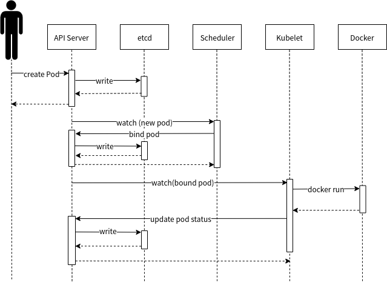

# Golang开发岗面试笔记

[toc]

## Go中的问题

### channel

#### channel的3种状态

1. nil，未初始化的状态，只进行了声明，或者手动赋值为nil
2. active，正常的channel，可读或可写
3. closed，已关闭，值得注意的是关闭的channel不是nil

#### channel的3种操作

1. 读
2. 写
3. 关闭

#### 3种状态和3种操作可以组成9种情况

| 操作      | nil的channel | 正常channel | 已关闭channel |
| --------- | ------------ | ----------- | ------------- |
| <-ch      | 阻塞         | 成功或阻塞  | 读到零值      |
| ch<-      | 阻塞         | 成功或阻塞  | panic         |
| close(ch) | panic        | 成功        | panic         |

对于nil通道的情况，也并非完全遵循上表，有1个特殊场景：当nil的通道在select的某个case中时，这个case会阻塞，但不会造成死锁。

#### channel 的常用操作

##### 使用for range 读取 channel

使用for-range读取channel，这样既安全又便利，当channel关闭时，for循环会自动退出，无需主动监测channel是否关闭，可以防止读取已经关闭的channel，造成读到数据为通道所存储的数据类型的零值。

```go
for x := range ch{
    fmt.Println(x)
}
```

##### 使用_,ok判断channel是否关闭

读已关闭的channel会得到零值，如果不确定channel，需要使用ok进行检测。ok的结果和含义：

* true:读到数据，并且通道没有关闭
* false:通道关闭，无数据读到

```go
if v, ok := <- ch; ok {
    fmt.Println(v)
}
```

##### 使用select处理多个channel

select可以同时监控多个通道的情况，只处理未阻塞的case。当通道为nil时，对应的case永远为阻塞，无论读写。特殊关注：普通情况下，对nil的通道写操作是要panic的

```go
// 分配job时，如果收到关闭的通知则退出，不分配job
func (h *Handler) handle(job *Job) {
    select {
    case h.jobCh<-job:
        return 
    case <-h.stopCh:
        return
    }
}
```

##### 使用channel的声明控制读写权限

可以控制channel的读写权限，避免channel做出危险的动作：

```go
//定义只读的channel

read_only := make (<-chan int)

//定义只写的channel

write_only := make (chan<- int)

//可同时读写

read_write := make (chan int)
```

close只能使用有写权限的channel

##### 使用缓冲channel增强并发

有缓冲通道可供多个协程同时处理，在一定程度可提高并发性。

```go
// 无缓冲
ch1 := make(chan int)
ch2 := make(chan int, 0)
// 有缓冲
ch3 := make(chan int, 1)
```

##### 为操作加上超时

使用select和time.After，看操作和定时器哪个先返回，处理先完成的，就达到了超时控制的效果

```go
func doWithTimeOut(timeout time.Duration) (int, error) {
    select {
    case ret := <-do():
        return ret, nil
    case <-time.After(timeout):
        return 0, errors.New("timeout")
    }
}

func do() <-chan int {
    outCh := make(chan int)
    go func() {
        // do work
    }()
    return outCh
}
```

###### 使用close(ch)关闭所有下游协程

所有读ch的协程都会收到close(ch)的信号

```go
func (h *Handler) Stop() {
    close(h.stopCh)

    // 可以使用WaitGroup等待所有协程退出
}

// 收到停止后，不再处理请求
func (h *Handler) loop() error {
    for {
        select {
        case req := <-h.reqCh:
            go handle(req)
        case <-h.stopCh:
            return
        }
    }
}
```

### Go实现无限制缓存大小的channel

go内置的channel有无缓冲和有缓存两种，现在需要实现无限缓存的channel

```go
package main

import (
 "fmt"
 "sync"
 "time"
)

type InfChannel struct {
 in        chan int // 输入channel
 out       chan int // 输出channel
 cond      *sync.Cond
 buffer    []int      // 缓存
 bufLock   sync.Mutex // 缓存的锁
 closeFlag bool
}

func NewInfChannel(cap int) *InfChannel {
 ch := &InfChannel{
  in:      make(chan int, cap),
  out:     make(chan int, cap),
  cond:    sync.NewCond(&sync.Mutex{}),
  buffer:  []int{},
  bufLock: sync.Mutex{},
 }
 go ch.inWorker()
 go ch.outWorker()
 return ch
}

func (ch *InfChannel) In(data int) {
 ch.in <- data
}

func (ch *InfChannel) Out() <-chan int {
 return ch.out
}
func (ch *InfChannel) Close() {
 close(ch.in)
 ch.closeFlag = true
 // 还需要触发一次cond避免其已经陷入wait无法获取close
 ch.cond.Signal()
}

func (ch *InfChannel) inWorker() {
 for data := range ch.in {
  ch.bufLock.Lock()
  ch.buffer = append(ch.buffer, data)
  ch.bufLock.Unlock()
  // 调用cond，说明buf中已经有数据
  ch.cond.Signal()
 }
}

func (ch *InfChannel) outWorker() {
 for {
  ch.cond.L.Lock()
  // cond等待缓存非空，如果为空等待，如果为空，且发现通道以及关闭，那么关闭输出并且返回
  for len(ch.buffer) == 0 {
   if ch.closeFlag {
    close(ch.out)
    return
   }
   ch.cond.Wait()
  }
  ch.out <- ch.buffer[0]
  ch.bufLock.Lock()
  ch.buffer = ch.buffer[1:]
  ch.bufLock.Unlock()
  ch.cond.L.Unlock()
 }
}

```

### GO做题常用的包

#### 排序sort

```go
import "sort"

package sort
type Interface interface {
    Len() int            // 获取元素数量
    Less(i, j int) bool // i，j是序列元素的指数。
    Swap(i, j int)        // 交换元素
}

func Reverse(data Interface) Interface
func IsSorted(data Interface) bool

// 内置的实现了Interface的类型：
type IntSlice []int
type Float64Slice []float64
type StringSlice []string

// 封装好的排序方法
func Ints(x []int) { Sort(IntSlice(x)) }
func Float64s(x []float64) { Sort(Float64Slice(x)) }
func Strings(x []string) { Sort(StringSlice(x)) }

// 判断是否已经排序
func IntsAreSorted(x []int) bool { return IsSorted(IntSlice(x)) }
func Float64sAreSorted(x []float64) bool { return IsSorted(Float64Slice(x)) }
func StringsAreSorted(x []string) bool { return IsSorted(StringSlice(x)) }
```

#### 堆

```go

import (
 "container/heap"
 "fmt"
)

// An IntHeap is a min-heap of ints.
type IntHeap []int

func (h IntHeap) Len() int           { return len(h) }
func (h IntHeap) Less(i, j int) bool { return h[i] < h[j] }
func (h IntHeap) Swap(i, j int)      { h[i], h[j] = h[j], h[i] }

func (h *IntHeap) Push(x interface{}) {
 // Push and Pop use pointer receivers because they modify the slice's length,
 // not just its contents.
 *h = append(*h, x.(int))
}

func (h *IntHeap) Pop() interface{} {
 old := *h
 n := len(old)
 x := old[n-1]
 *h = old[0 : n-1]
 return x
}

// This example inserts several ints into an IntHeap, checks the minimum,
// and removes them in order of priority.
func Example_intHeap() {
 h := &IntHeap{2, 1, 5}
 heap.Init(h)
 heap.Push(h, 3)
 fmt.Printf("minimum: %d\n", (*h)[0])
 for h.Len() > 0 {
  fmt.Printf("%d ", heap.Pop(h))
 }
 // Output:
 // minimum: 1
 // 1 2 3 5
}
```

### Go的Map做GC吗？

在 Golang 中的 map 结构，在删除键值对的时候，并不会真正的删除，而是标记。那么随着键值对越来越多，会不会造成大量内存浪费？

首先答案是会的，很有可能导致 OOM

### Go中数组和切片的底层是什么

数组是一个由固定长度的特定类型元素组成的序列，一个数组可以由零个或多个元素组成。数组的长度是数组类型的组成部分。因为数组的长度是数组类型的一个部分，不同长度或不同类型的数据组成的数组都是不同的类型。

在Go中数组传值，切片传指针。

> 用for range方式迭代的性能可能会更好一些，因为这种迭代可以保证不会出现数组越界的情形，每轮迭代对数组元素的访问时可以省去对下标越界的判断。

切片就是简化版的动态数组，切片的结构定义：

```go
type SliceHeader struct {
    Data uintptr
    Len  int
    Cap  int
}
```

#### 切片的操作

在对切片本身赋值或参数传递时，和数组指针的操作方式类似，只是复制切片头信息（reflect.SliceHeader），并不会复制底层的数据。

#### 动态数组

动态数组，是相对于静态数组而言。静态数组的长度是预先定义好的，在整个程序中，一旦给定大小后就无法改变。而动态数组则不然，它可以随程序需要而重新指定大小。动态数组的内存空间是从堆（heap）上分配（即动态分配）的。是通过执行代码而为其分配存储空间。当程序执行到这些语句时，才为其分配。

> 不过要注意的是，在容量不足的情况下，`append的操作会导致重新分配内存`，可能导致巨大的内存分配和复制数据代价。`即使容量足够，依然需要用append函数的返回值来更新切片本身，因为新切片的长度已经发生了变化`。
> 在开头一般都会导致内存的重新分配，而且会导致已有的元素全部复制1次。因此，从切片的开头添加元素的性能一般要比从尾部追加元素的性能差很多。

### Go的源代码的编译过程是什么

可重定位目标程序：编译器编译后产生的目标文件是可重定位的程序模块，并不能直接运行，链接就是把目标文件和其他分别进行编译生成的程序模块（如果有的话）及系统提供的标准库函数连接在一起，生成可运行的可执行文件的过程。
重定位是链接器在完成符号解析后（知道了各个输入模块的代码段和数据段的大小）的一个步骤，其作用顾名思义就是重新定位，确定比如指令，全局变量等在运行时的存储器地址。


### happens before原则

在执行了带有 Happens Before 语义的指令时，这个指令之前的代码影响面必须在执行该指令之后的代码之前已存在。

#### 为什么需要Happens before

程序实际运行中CPU为了优化代码，可能会发生重排序

### Go的同步原语与锁

这部分主要摘自 <https://draveness.me/golang/docs/part3-runtime/ch06-concurrency/golang-sync-primitives/> 细节可以直接看原文

#### Mutex

互斥锁的加锁过程比较复杂，它涉及自旋、信号量以及调度等概念：

* 如果互斥锁处于初始化状态，会通过置位 mutexLocked 加锁；
* 如果互斥锁处于 mutexLocked 状态并且在普通模式下工作，会进入自旋，执行 30 次 PAUSE 指令消耗 CPU 时间等待锁的释放；
* 如果当前 Goroutine 等待锁的时间超过了 1ms，互斥锁就会切换到饥饿模式；
* 互斥锁在正常情况下会通过 runtime.sync_runtime_SemacquireMutex 将尝试获取锁的 Goroutine 切换至休眠状态，等待锁的持有者唤醒；
* 如果当前 Goroutine 是互斥锁上的最后一个等待的协程或者等待的时间小于 1ms，那么它会将互斥锁切换回正常模式；

互斥锁的解锁过程与之相比就比较简单，其代码行数不多、逻辑清晰，也比较容易理解：

* 当互斥锁已经被解锁时，调用 sync.Mutex.Unlock 会直接抛出异常；
* 当互斥锁处于饥饿模式时，将锁的所有权交给队列中的下一个等待者，等待者会负责设置 mutexLocked 标志位；
* 当互斥锁处于普通模式时，如果没有 Goroutine 等待锁的释放或者已经有被唤醒的 Goroutine 获得了锁，会直接返回；在其他情况下会通过 sync.runtime_Semrelease 唤醒对应的 Goroutine；

#### RWMutex

读写互斥锁 sync.RWMutex 是细粒度的互斥锁，它不限制资源的并发读，但是读写、写写操作无法并行执行
虽然读写互斥锁 sync.RWMutex 提供的功能比较复杂，但是因为它建立在 sync.Mutex 上，所以实现会简单很多。我们总结一下读锁和写锁的关系：

* 调用 sync.RWMutex.Lock 尝试获取写锁时；
  * 每次 sync.RWMutex.RUnlock 都会将 readerCount 其减一，当它归零时该 Goroutine 会获得写锁；
  * 将 readerCount 减少 rwmutexMaxReaders 个数以阻塞后续的读操作；
* 调用 sync.RWMutex.Unlock 释放写锁时，会先通知所有的读操作，然后才会释放持有的互斥锁；

读写互斥锁在互斥锁之上提供了额外的更细粒度的控制，能够在读操作远远多于写操作时提升性能。

#### WaitGroup

sync.WaitGroup 可以等待一组 Goroutine 的返回，一个比较常见的使用场景是批量发出 RPC 或者 HTTP 请求

* sync.WaitGroup 必须在 sync.WaitGroup.Wait 方法返回之后才能被重新使用；
* sync.WaitGroup.Done 只是对 sync.WaitGroup.Add 方法的简单封装，我们可以向 sync.WaitGroup.Add 方法传入任意负数（需要保证计数器非负）快速将计数器归零以唤醒等待的 Goroutine；
* 可以同时有多个 Goroutine 等待当前 sync.WaitGroup 计数器的归零，这些 Goroutine 会被同时唤醒；

#### Once

Go 语言标准库中 sync.Once 可以保证在 Go 程序运行期间的某段代码只会执行一次。

作为用于保证函数执行次数的 sync.Once 结构体，它使用互斥锁和 sync/atomic 包提供的方法实现了某个函数在程序运行期间只能执行一次的语义。在使用该结构体时，我们也需要注意以下的问题：

* sync.Once.Do 方法中传入的函数只会被执行一次，哪怕函数中发生了 panic；
* 两次调用 sync.Once.Do 方法传入不同的函数只会执行第一次调传入的函数；

#### Cond

Go 语言标准库中还包含条件变量 sync.Cond，它可以让一组的 Goroutine 都在满足特定条件时被唤醒。每一个 sync.Cond 结构体在初始化时都需要传入一个互斥锁。

sync.Cond 不是一个常用的同步机制，但是在条件长时间无法满足时，与使用 for {} 进行忙碌等待相比，sync.Cond 能够让出处理器的使用权，提高 CPU 的利用率。使用时我们也需要注意以下问题：

* sync.Cond.Wait 在调用之前一定要使用获取互斥锁，否则会触发程序崩溃；
* sync.Cond.Signal 唤醒的 Goroutine 都是队列最前面、等待最久的 Goroutine；
* sync.Cond.Broadcast 会按照一定顺序广播通知等待的全部 Goroutine；

#### 扩展原语

* ErrGroup
golang/sync/errgroup.Group 为我们在一组 Goroutine 中提供了同步、错误传播以及上下文取消的功能
  * golang/sync/errgroup.Group 在出现错误或者等待结束后会调用 context.Context 的 cancel 方法同步取消信号；
  * 只有第一个出现的错误才会被返回，剩余的错误会被直接丢弃；
* Semaphore
信号量是在并发编程中常见的一种同步机制，在需要控制访问资源的进程数量时就会用到信号量，它会保证持有的计数器在 0 到初始化的权重之间波动
带权重的信号量确实有着更多的应用场景，这也是 Go 语言对外提供的唯一一种信号量实现，在使用的过程中我们需要注意以下的几个问题：
  * golang/sync/semaphore.Weighted.Acquire 和 golang/sync/semaphore.Weighted.TryAcquire 都可以用于获取资源，前者会阻塞地获取信号量，后者会非阻塞地获取信号量；
  * golang/sync/semaphore.Weighted.Release 方法会按照先进先出的顺序唤醒可以被唤醒的 Goroutine；
  * 如果一个 Goroutine 获取了较多地资源，由于 golang/sync/semaphore.Weighted.Release 的释放策略可能会等待比较长的时间；
* SingleFlight
当我们需要减少对下游的相同请求时，可以使用 golang/sync/singleflight.Group 来增加吞吐量和服务质量，不过在使用的过程中我们也需要注意以下的几个问题：
  * golang/sync/singleflight.Group.Do 和 golang/sync/singleflight.Group.DoChan 一个用于同步阻塞调用传入的函数，一个用于异步调用传入的参数并通过 Channel 接收函数的返回值；
  * golang/sync/singleflight.Group.Forget 可以通知 golang/sync/singleflight.Group 在持有的映射表中删除某个键，接下来对该键的调用就不会等待前面的函数返回了；
  * 一旦调用的函数返回了错误，所有在等待的 Goroutine 也都会接收到同样的错误；

### 介绍下Context

上下文 context.Context Go 语言中用来设置截止日期、同步信号，传递请求相关值的结构体。

Go 语言中的 context.Context 的主要作用还是在多个 Goroutine 组成的树中同步取消信号以减少对资源的消耗和占用，虽然它也有传值的功能，但是这个功能我们还是很少用到。

在真正使用传值的功能时我们也应该非常谨慎，使用 context.Context 传递请求的所有参数一种非常差的设计，比较常见的使用场景是传递请求对应用户的认证令牌以及用于进行分布式追踪的请求 ID。

### 为什么会发生死锁，举个死锁的例子

产生死锁的原因主要是：

因为系统资源不足。
进程运行推进的顺序不合适。
资源分配不当等。
如果系统资源充足，进程的资源请求都能够得到满足，死锁出现的可能性就很低，否则就会因争夺有限的资源而陷入死锁。其次，进程运行推进顺序与速度不同，也可能产生死锁。

产生死锁的四个必要条件：

互斥条件：一个资源每次只能被一个进程使用。
请求与保持条件：一个进程因请求资源而阻塞时，对已获得的资源保持不放。
不剥夺条件:进程已获得的资源，在末使用完之前，不能强行剥夺。
循环等待条件:若干进程之间形成一种头尾相接的循环等待资源关系。
这四个条件是死锁的必要条件，只要系统发生死锁，这些条件必然成立，而只要上述条件之一不满足，就不会发生死锁。

死锁的解除与预防：

理解了死锁的原因，尤其是产生死锁的四个必要条件，就可以最大可能地避免、预防和解除死锁。

所以，在系统设计、进程调度等方面注意如何不让这四个必要条件成立，如何确定资源的合理分配算法，避免进程永久占据系统资源。

此外，也要防止进程在处于等待状态的情况下占用资源。

因此，对资源的分配要给予合理的规划。

### CAS是什么，Go里面怎么做

比较并交换(compare and swap, CAS)，是原子操作的一种，可用于在多线程编程中实现不被打断的数据交换操作，从而避免多线程同时改写某一数据时由于执行顺序不确定性以及中断的不可预知性产生的数据不一致问题。 该操作通过将内存中的值与指定数据进行比较，当数值一样时将内存中的数据替换为新的值。

```go
func incCounter(index int) {
    defer wg.Done()

    spinNum := 0
    for {
        //2.1原子操作
        old := counter
        ok := atomic.CompareAndSwapInt32(&counter, old, old+1)
        if ok {
            break
        } else {
            spinNum++
        }
    }

    fmt.Printf("thread,%d,spinnum,%d\n",index,spinNum)

}
```

go中CAS操作可以有效的减少使用锁所带来的开销，但是需要注意在高并发下这是使用cpu资源做交换的。

#### CAS的缺陷

CAS在共享资源竞争比较激烈的时候，每个goroutine会容易处于自旋状态，影响效率，在竞争激烈的时候推荐使用锁。
无法解决ABA问题

* ABA问题是无锁结构实现中常见的一种问题，可基本表述为：

>进程P1读取了一个数值A
>P1被挂起(时间片耗尽、中断等)，进程P2开始执行
>P2修改数值A为数值B，然后又修改回A
>P1被唤醒，比较后发现数值A没有变化，程序继续执行。

### Go中的Int的大小

GO语言中int类型的大小是不确定的，与具体的平台有关系
一般来说，int在32位系统中是4字节，在64位系统中是8字节

### Goroutine ID是什么

就是每个Goroutine的编号

#### 如何获取

Go中没有提供直接goid的获取方式，这么做是为了避免写出的程序过度的依赖goid导致复杂化。
不过还是有办法获取的：

1. 通过runtime.Stack获取调用栈，间接获取
2. 通过Go的汇编语言获取

### Go的GC的处理

go语言垃圾回收总体采用的是经典的mark and sweep算法。

* v1.3以前版本 STW（Stop The World）
* v1.3 Mark STW, Sweep 并行
* v1.5 三色标记法
* v1.8 混合写屏障（hybrid write barrier）

#### 常见的GC方法

1. 引用计数（reference counting）
2. 标记-清除（mark and sweep）
3. 复制收集
4. 分代收集（generation

### Go的并发体系的理论是什么（CSP）

CSP(Commiunicating Sequential Process,通讯顺序进程)

> Do not communicate by sharing memory; instead, share memory by communicating.

不要通过共享内存来通信，而应通过通信来共享内存。

### Go的协程和Python的协程以及JAVA的多线程之间的区别

* N:1，Python协程模式，多个协程在一个线程中切换。在IO密集时切换效率高，但没有用到多核
* 1:1，Java多线程模式，每个协程只在一个线程中运行，这样协程和线程没区别，虽然用了多核，但是线程切换开销大。
* M:N，go模式，多个协程在多个线程上切换，既可以用到多核，又可以减少切换开销。（当都是cpu密集时，在多核上切换好，当都是io密集时，在单核上切换好）。

### Go为什么适合高并发

Goroutine协程更轻量，占用内存更小，这是它能做到高并发的前提。

### Go的协程与线程、进程之间的区别

`进程是操作系统资源分配的基本单位，线程是操作系统调度和执行的最小单位。`
进程是程序的启动实例，拥有代码和打开的文件资源、数据资源、独立的内存空间。
线程从属于进程，是程序的实际执行者，一个进程至少包含一个主线程，也可以有更多的子线程，线程拥有自己的栈空间。无论是进程还是线程，都是由操作系统所管理和切换的。

我们再来看协程，它又叫做微线程，但其实它和进程还有线程完全不是一个维度上的概念。`进程和线程的切换完全是用户无感，由操作系统控制，从用户态到内核态再到用户态。`而协程的切换完全是程序代码控制的，`在用户态的切换`，就像函数回调的消耗一样，在线程的栈内即可完成。

### GO的竞争检测

通过`go run -race main.go`

#### 解决方法

WaitGroup、通道阻塞、Mutex锁

## 计算机网络中的问题

### DNS解析过程

场景：用户在浏览器输入网址：domain.com，其解析过程如下：
第1步：**浏览器将会检查缓存中有没有这个域名对应的解析过的IP地址**，如果有该解析过程将会结束。
第2步：如果用户的浏览器中缓存中没有，操作系统会先**检查自己本地的hosts文件**是否有这个网址映射关系，如果有，就先调用这个IP地址映射关系，完成域名解析。
第3步：如果hosts里没有这个域名的映射，则**查找本地DNS解析器缓存**，是否有这个网址映射关系或缓存信息，如果有，直接返回给浏览器，完成域名解析。
第4步：如果hosts与本地DNS解析器缓存都没有相应的网址映射关系，则会首先**找本地DNS服务器**，一般是公司内部的DNS服务器，此服务器收到查询，如果此本地DNS服务器查询到相对应的IP地址映射或者缓存信息，则返回解析结果给客户机，完成域名解析，此解析具有权威性。
第5步：如果本地DNS服务器无法查询到，则根据本地DNS服务器设置的转发器进行查询；
**未用转发模式**：**本地DNS就把请求发至根DNS进行**（迭代）查询，根DNS服务器收到请求后会判断这个域名(.com)是谁来授权管理，并会返回一个负责该顶级域名服务器的一个IP。本地DNS服务器收 到IP信息后，将会联系负责.com域的这台服务器。这台负责.com域的服务器收到请求后，如果自己无法解析，它就会找一个管理.com域的下一级 DNS服务器地址给本地DNS服务器。当本地DNS服务器收到这个地址后，就会找域名域服务器，重复上面的动作，进行查询，直至找到域名对应的主机。
**使用转发模式**：此**DNS服务器就会把请求转发至上一级DNS服务器**，由上一级服务器进行解析，上一级服务器如果不能解析，或找根DNS或把转请求转至 上上级，以此循环。不管是本地DNS服务器用是是转发，还是根提示，最后都是把结果返回给本地DNS服务器，由此DNS服务器再返回给客户机。

### HTTP请求报文


### HTTP响应报文


### http1.0、1.1、2.0、3.0

#### HTTP 1.0

**短连接**：每次发送请求都要重新建立tcp请求，即三次握手，非常浪费性能

无host头域，也就是http请求头里的host，

**不允许断点续传**，而且不能只传输对象的一部分，要求传输整个对象

#### HTTP 1.1

**长连接**，流水线，使用connection:keep-alive，使用长连接，**服务端还是按照FIFO原则**来处理不同的Request与http 2.0不同的是，由于长连接会给服务器造成压力，不是真正的并发传输

host头域

#### HTTP 2.0

**头部压缩**，双方各自维护一个header的索引表，使得不需要直接发送值，通过发送key缩减头部大小

**多路复用**，使用多个stream，每个stream又分帧传输，使得**一个tcp连接能够处理多个http请求**

可以使用**服务端推送**

#### HTTP 3.0

基于google的**QUIC协议**，而quic协议是使用**udp实现**的

减少了tcp三次握手时间，以及tls握手时间

解决了http 2.0中前一个stream丢包导致后一个stream被阻塞的问题

优化了重传策略，重传包和原包的编号不同，降低后续重传计算的消耗

连接迁移，不再用tcp四元组确定一个连接，而是用一个64位随机数来确定这个连接

更合适的流量控制

### OSI 7层模型

1. **物理层**：在局部局域网上发送数据帧（Data Frame），它负责管理电脑通信设备和网络媒体之间的互通。包括了针脚、电压、线缆规范、集线器、中继器、网卡、主机接口卡等。
2. **数据链路层**：负责网络寻址、错误侦测和改错。当表头和表尾被加至数据包时，会形成信息框（Data Frame）。数据链表头（DLH）是包含了物理地址和错误侦测及改错的方法。数据链表尾（DLT）是一串指示数据包末端的字符串。例如以太网、无线局域网（Wi-Fi）和通用分组无线服务（GPRS）等。
    分为两个子层：逻辑链路控制（logical link control，LLC）子层和介质访问控制（Media access control，MAC）子层。
3. **网络层**：决定数据的路径选择和转寄，将网络表头（NH）加至数据包，以形成分组。网络表头包含了网络资料。例如:互联网协议（IP）等。
4. **传输层**：把传输表头（TH）加至数据以形成数据包。传输表头包含了所使用的协议等发送信息。例如:传输控制协议（TCP）等。
5. **会话层**：负责在数据传输中设置和维护计算机网络中两台计算机之间的通信连接。
6. **表示层**：把数据转换为能与接收者的系统格式兼容并适合传输的格式。
7. **应用层**：提供为应用软件而设计的接口，以设置与另一应用软件之间的通信。例如：HTTP、HTTPS、FTP、Telnet、SSH、SMTP、POP3等。

### TCP报文首部

1. 源端口和目的端口，各占2个字节，分别写入源端口和目的端口
2. 序号seq，占4个字节，`TCP连接中传送的字节流中的每个字节都按顺序编号`。例如，一段报文的序号字段值是 301 ，而携带的数据共有100字段，显然下一个报文段（如果还有的话）的数据序号应该从401开始；
3. 确认号ack，占4个字节，`是期望收到对方下一个报文的第一个数据字节的序号`。例如，B收到了A发送过来的报文，其序列号字段是501，而数据长度是200字节，`这表明B正确的收到了A发送的到序号700为止的数据`。因此，B期望收到A的下一个数据序号是701，于是B在发送给A的确认报文段中把确认号置为701；
4. 数据偏移，占4位，它指出TCP报文的数据距离TCP报文段的起始处有多远；
5. 保留，占6位，保留今后使用，但目前应都位0；
6. 紧急URG，当URG=1，表明紧急指针字段有效。告诉系统此报文段中有紧急数据；
7. 确认ACK，仅当ACK=1时，确认号字段才有效。TCP规定，在连接建立后所有报文的传输都必须把ACK置1；
8. 推送PSH，当两个应用进程进行交互式通信时，有时在一端的应用进程希望在键入一个命令后立即就能收到对方的响应，这时候就将PSH=1；
9. 复位RST，当RST=1，表明TCP连接中出现严重差错，必须释放连接，然后再重新建立连接；
10. 同步SYN，在连接建立时用来同步序号，三次握手的前两次的连接请求中有。当SYN=1，ACK=0，表明是连接请求报文，若同意连接，则响应报文中应该使SYN=1，ACK=1；
11. 终止FIN，用来释放连接。当FIN=1，表明此报文的发送方的数据已经发送完毕，并且要求释放；
12. 窗口，占2字节，指的是通知接收方，发送本报文你需要有多大的空间来接受；
13. 检验和，占2字节，校验首部和数据这两部分；
14. 紧急指针，占2字节，指出本报文段中的紧急数据的字节数；
15. 选项，长度可变，定义一些其他的可选的参数。

### TCP连接的建立（三次握手）


1. TCP服务器进程先创建传输控制块TCB，时刻准备接受客户进程的连接请求，此时服务器就进入了LISTEN（监听）状态；
2. TCP客户进程也是先创建传输控制块TCB，然后向服务器发出连接请求报文，这是报文首部中的同部位SYN=1，同时选择一个初始序列号 seq=x ，此时，TCP客户端进程进入了 SYN-SENT（同步已发送状态）状态。`TCP规定，SYN报文段（SYN=1的报文段）不能携带数据，但需要消耗掉一个序号。`
3. TCP服务器收到请求报文后，如果同意连接，则发出确认报文。确认报文中应该 ACK=1，SYN=1，确认号是ack=x+1，同时也要为自己初始化一个序列号 seq=y，此时，TCP服务器进程进入了SYN-RCVD（同步收到）状态。`这个报文也不能携带数据，但是同样要消耗一个序号。`
4. TCP客户进程收到确认后，还要向服务器给出确认。确认报文的ACK=1，ack=y+1，自己的序列号seq=x+1，此时，TCP连接建立，客户端进入ESTABLISHED（已建立连接）状态。`TCP规定，ACK报文段可以携带数据，但是如果不携带数据则不消耗序号。`
5. 当服务器收到客户端的确认后也进入ESTABLISHED状态，此后双方就可以开始通信了。

#### 为什么TCP客户端最后还要发送一次确认呢？

一句话，主要防止已经失效的连接请求报文突然又传送到了服务器，从而产生错误。

如果使用的是两次握手建立连接，假设有这样一种场景，`客户端发送了第一个请求连接并且没有丢失，只是因为在网络结点中滞留的时间太长了`，由于TCP的客户端迟迟没有收到确认报文，以为服务器没有收到，此时重新向服务器发送这条报文，此后客户端和服务器经过两次握手完成连接，传输数据，然后关闭连接。此时此前滞留的那一次请求连接，网络通畅了到达了服务器，这个报文本该是失效的，但是，两次握手的机制将会让客户端和服务器再次建立连接，这将导致不必要的错误和资源的浪费。

如果采用的是三次握手，就算是那一次失效的报文传送过来了，服务端接受到了那条失效报文并且回复了确认报文，但是客户端不会再次发出确认。由于服务器收不到确认，就知道客户端并没有请求连接。

### TCP连接的释放（四次挥手）


1. 客户端进程发出连接释放报文，并且停止发送数据。释放数据报文首部，FIN=1，其序列号为seq=u（等于前面已经传送过来的数据的最后一个字节的序号加1），此时，客户端进入FIN-WAIT-1（终止等待1）状态。 `TCP规定，FIN报文段即使不携带数据，也要消耗一个序号。`
2. 服务器收到连接释放报文，发出确认报文，ACK=1，ack=u+1，并且带上自己的序列号seq=v，此时，服务端就进入了CLOSE-WAIT（关闭等待）状态。`TCP服务器通知高层的应用进程，客户端向服务器的方向就释放了，这时候处于半关闭状态，即客户端已经没有数据要发送了，但是服务器若发送数据，客户端依然要接受。这个状态还要持续一段时间，也就是整个CLOSE-WAIT状态持续的时间`。
3. 客户端收到服务器的确认请求后，此时，客户端就进入FIN-WAIT-2（终止等待2）状态，等待服务器发送连接释放报文`（在这之前还需要接受服务器发送的最后的数据）`。
4. 服务器将最后的数据发送完毕后，就向客户端发送连接释放报文，FIN=1，ack=u+1，由于在半关闭状态，服务器很可能又发送了一些数据，假定此时的序列号为seq=w，此时，服务器就进入了LAST-ACK（最后确认）状态，等待客户端的确认。
5. 客户端收到服务器的连接释放报文后，必须发出确认，ACK=1，ack=w+1，而自己的序列号是seq=u+1，此时，客户端就进入了TIME-WAIT（时间等待）状态。`注意此时TCP连接还没有释放，必须经过2∗ *∗MSL（最长报文段寿命）的时间后，当客户端撤销相应的TCB后，才进入CLOSED状态。`
6. 服务器只要收到了客户端发出的确认，立即进入CLOSED状态。同样，撤销TCB后，就结束了这次的TCP连接。`可以看到，服务器结束TCP连接的时间要比客户端早一些。`

#### 为什么客户端最后还要等待2MSL？

MSL（Maximum Segment Lifetime），TCP允许不同的实现可以设置不同的MSL值。

第一，保证客户端发送的最后一个ACK报文能够到达服务器，因为这个ACK报文可能丢失，`站在服务器的角度看来，我已经发送了FIN+ACK报文请求断开了，客户端还没有给我回应，应该是我发送的请求断开报文它没有收到，于是服务器又会重新发送一次`，而客户端就能在这个2MSL时间段内收到这个重传的报文，接着给出回应报文，并且会重启2MSL计时器。

第二，防止类似与“三次握手”中提到了的“已经失效的连接请求报文段”出现在本连接中。客户端发送完最后一个确认报文后，在这个2MSL时间中，就可以使本连接持续的时间内所产生的所有报文段都从网络中消失。这样新的连接中不会出现旧连接的请求报文。

#### 为什么建立连接是三次握手，关闭连接确是四次挥手呢？

建立连接的时候， 服务器在LISTEN状态下，收到建立连接请求的SYN报文后，把ACK和SYN放在一个报文里发送给客户端。
而关闭连接时，服务器收到对方的FIN报文时，仅仅表示对方不再发送数据了但是还能接收数据，而自己也未必全部数据都发送给对方了，所以己方可以立即关闭，也可以发送一些数据给对方后，再发送FIN报文给对方来表示同意现在关闭连接，因此，己方ACK和FIN一般都会分开发送，从而导致多了一次。

#### 如果已经建立了连接，但是客户端突然出现故障了怎么办？

TCP还设有一个保活计时器，显然，客户端如果出现故障，服务器不能一直等下去，白白浪费资源。服务器每收到一次客户端的请求后都会重新复位这个计时器，时间通常是设置为2小时，若两小时还没有收到客户端的任何数据，服务器就会发送一个探测报文段，以后每隔75秒发送一次。若一连发送10个探测报文仍然没反应，服务器就认为客户端出了故障，接着就关闭连接。

### TCP/IP 4层模型

1. 应用层
2. 传输层
3. 网络层
4. 数据链路层

### OSI 7层模型和TCP/IP 4层模型


### 在浏览器中输入网址后的过程

* DNS 解析:将域名解析成 IP 地址
* TCP 连接：TCP 三次握手
* 发送 HTTP 请求
* 服务器处理请求并返回 HTTP 报文
* 浏览器解析渲染页面
* 断开连接：TCP 四次挥手

### HTTPS的过程


### RPC与HTTP

http 和 rpc 并不是一个并行概念。

rpc是远端过程调用，其调用协议通常包含传输协议和序列化协议。http是最常用的承载RPC的通信协议之一。

### 了解过tcp,udp吗，你觉得QQ上如果要使用tcp,udp的话会怎么取选用

#### TCP和UDP之间的区别

1、基于连接与无连接；
2、对系统资源的要求（TCP较多，UDP少）；
3、UDP程序结构较简单；
4、流模式与数据报模式 ；
5、TCP保证数据正确性，UDP可能丢包；
6、TCP保证数据顺序，UDP不保证。

单就QQ用户消息的传递而言：

最早年是UDP，而且是P2P的。

1）P2P的UDP穿透容易。这个应该是主要原因。
2）UDP成本低。

## 计算机系统中的问题

### 上下文切换

CPU 寄存器和程序计数器就是 CPU 上下文，因为它们都是 CPU 在运行任何任务前，必须的依赖环境。

CPU 寄存器是 CPU 内置的容量小、但速度极快的内存。
程序计数器则是用来存储 CPU 正在执行的指令位置、或者即将执行的下一条指令位置。

#### 什么是 CPU 上下文切换

就是先把前一个任务的 CPU 上下文（也就是 CPU 寄存器和程序计数器）保存起来，然后加载新任务的上下文到这些寄存器和程序计数器，最后再跳转到程序计数器所指的新位置，运行新任务。

而这些保存下来的上下文，会存储在系统内核中，并在任务重新调度执行时再次加载进来。这样就能保证任务原来的状态不受影响，让任务看起来还是连续运行。

根据任务的不同，可以分为以下三种类型 - 进程上下文切换 - 线程上下文切换 - 中断上下文切换

### 抢占式和非抢占式是什么

* 非抢占式（Nonpreemptive）
让进程运行直到结束或阻塞的调度方式容易实现适合专用系统，不适合通用系统
* 抢占式（Preemptive）  
允许将逻辑上可继续运行的在运行过程暂停的调度方式   可防止单一进程长时间独占CPU   系统开销大（降低途径：硬件实现进程切换，或扩充主存以贮存大部分程序）

### PID是什么

进程标识符（英语：process identifier，又略称为进程ID（英语：process ID）、PID）是大多数操作系统的内核用于唯一标识进程的一个数值。这一数值可以作为许多函数调用的参数，以使调整进程优先级、杀死进程之类的进程控制行为成为可能。

### namespace是什么

Linux Namespace是Linux提供的一种内核级别环境隔离的方法。

提供了对UTS、IPC、mount、PID、network、User等的隔离机制。

### CGroup

cgroups可以限制、记录、隔离进程组所使用的物理资源（包括：CPU、memory、IO等），为容器实现虚拟化提供了基本保证，是构建Docker等一系列虚拟化管理工具的基石。

### 什么是时钟时间、用户CPU时间、系统时间

时钟时间(墙上时钟时间wall clock time)：从进程从开始运行到结束，时钟走过的时间，这其中包含了进程在阻塞和等待状态的时间。

用户CPU时间：就是用户的进程获得了CPU资源以后，在用户态执行的时间。

系统CPU时间：用户进程获得了CPU资源以后，在内核态的执行时间。

时钟时间 ＝ 阻塞时间 ＋ 就绪时间 ＋运行时间
用户CPU时间 ＝ 运行状态下用户空间的时间
系统CPU时间 =  运行状态下系统空间的时间

### 用户态和内核态

为了区分不同的程序的不同权限，人们发明了内核态和用户态的概念。
用户态和内核态是操作系统的两种运行级别，两者最大的区别就是特权级不同。用户态拥有最低的特权级，内核态拥有较高的特权级。 运行在用户态的程序不能直接访问操作系统内核数据结构和程序。
内核态和用户态之间的转换方式主要包括：系统调用，异常和中断。

### 用户态和内核态的切换

当发生用户态到内核态的切换时，会发生如下过程（本质上是从“用户程序”切换到“内核程序”）

设置处理器至内核态。
保存当前寄存器（栈指针、程序计数器、通用寄存器）。
将栈指针设置指向内核栈地址。
将程序计数器设置为一个事先约定的地址上，该地址上存放的是系统调用处理程序的起始地址。
而之后从内核态返回用户态时，又会进行类似的工作。

### 进程的状态

初始态，执行态，等待状态，就绪状态，终止状态。

### 计算机操作系统中堆和栈的区别

栈：由编译器分配，存放函数的参数值、临时变量值等，操作方式类似于数据结构中的栈。

堆：由程序员分配，若程序员不进行释放，堆会在程序结束后OS进行释放。与数据结构中的堆是两回事，分配方式类似于链表，一般存放大的数据对象。

### 线程池有什么状态


* RUNNING:线程池处在RUNNING状态时，能够接收新任务，以及对已添加的任务进行处理。
* SHUTDOWN:线程池处在SHUTDOWN状态时，不接收新任务，但能处理已添加的任务。
* STOP:线程池处在STOP状态时，不接收新任务，不处理已添加的任务，并且会中断正在处理的任务。
* TIDYING:当所有的任务已终止，ctl记录的”任务数量”为0，线程池会变为TIDYING状态。当线程池变为TIDYING状态时，会执行钩子函数terminated()。terminated()在ThreadPoolExecutor类中是空的，若用户想在线程池变为TIDYING时，进行相应的处理；可以通过重载terminated()函数来实现。
* TERMINATED:线程池彻底终止，就变成TERMINATED状态。

### 线程有什么状态

1、新建状态:
使用 new 关键字和 Thread 类或其子类建立一个线程对象后，该线程对象就处于新建状态。它保持这个状态直到程序 start() 这个线程。
2、就绪状态:
当线程对象调用了start()方法之后，该线程就进入就绪状态。就绪状态的线程处于就绪队列中，要等待JVM里线程调度器的调度。
3、运行状态:
如果就绪状态的线程获取 CPU 资源，就可以执行 run()，此时线程便处于运行状态。处于运行状态的线程最为复杂，它可以变为阻塞状态、就绪状态和死亡状态。
4、阻塞状态:
如果一个线程执行了sleep（睡眠）、suspend（挂起）等方法，失去所占用资源之后，该线程就从运行状态进入阻塞状态。在睡眠时间已到或获得设备资源后可以重新进入就绪状态。可以分为三种：
等待阻塞：运行状态中的线程执行 wait() 方法，使线程进入到等待阻塞状态。
同步阻塞：线程在获取 synchronized同步锁失败(因为同步锁被其他线程占用)。
其他阻塞：通过调用线程的 sleep() 或 join() 发出了 I/O请求时，线程就会进入到阻塞状态。当sleep() 状态超时，join() 等待线程终止或超时，或者 I/O 处理完毕，线程重新转入就绪状态。
5、死亡状态:
一个运行状态的线程完成任务或者其他终止条件发生时，该线程就切换到终止状态。

### 进程间通信方式

#### 单机

* 管道( pipe )：管道是一种半双工的通信方式，数据只能单向流动，而且只能在具有亲缘关系的进程间使用。进程的亲缘关系通常是指父子进程关系。
* 有名管道 (namedpipe) ： 有名管道也是半双工的通信方式，但是它允许无亲缘关系进程间的通信。
* 消息队列( messagequeue ) ： 消息队列是由消息的链表，存放在内核中并由消息队列标识符标识。消息队列克服了信号传递信息少、管道只能承载无格式字节流以及缓冲区大小受限等缺点。
* 共享内存(shared memory ) ：共享内存就是映射一段能被其他进程所访问的内存，这段共享内存由一个进程创建，但多个进程都可以访问。共享内存是最快的 IPC 方式，它是针对其他进程间通信方式运行效率低而专门设计的。它往往与其他通信机制，如信号量，配合使用，来实现进程间的同步和通信。
* 信号量(semophore ) ： 信号量是一个计数器，可以用来控制多个进程对共享资源的访问。它常作为一种锁机制，防止某进程正在访问共享资源时，其他进程也访问该资源。因此，主要作为进程间以及同一进程内不同线程之间的同步手段。
* 信号 (signal) ： 信号是一种比较复杂的通信方式，用于通知接收进程某个事件已经发生。

#### 分布式

套接字(socket ) ： 套解口也是一种进程间通信机制，与其他通信机制不同的是，它可用于不同机器间的进程通信。

### 线程间通信方式

* 锁机制：包括互斥锁、条件变量、读写锁
  * 互斥锁提供了以排他方式防止数据结构被并发修改的方法。
  * 读写锁允许多个线程同时读共享数据，而对写操作是互斥的。
  * 条件变量可以以原子的方式阻塞进程，直到某个特定条件为真为止。对条件的测试是在互斥锁的保护下进行的。条件变量始终与互斥锁一起使用。
* 信号量机制(Semaphore)：包括无名线程信号量和命名线程信号量
* 信号机制(Signal)：类似进程间的信号处理

线程间的通信目的主要是用于线程同步，所以线程没有像进程通信中的用于数据交换的通信机制。

### 事务四个特性等

四大特性：ACID
原子性（Atomicity）、一致性（Consistency）、隔离性（Isolation）、持久性（Durability）。

### 原子性是什么？

原子性其实非常好理解，我认为它指的就是一种完整性，就是说任何一个具备原子性的事务只有两种状态：完成操作 和 未操作。原子性保证事务的一切操作要么一起成功要么一起失败。原子性的事务一旦开始就一直运行到结束，它不会被线程调度机制中断。如果遇到强制性中断，就会全部回滚到最初未操作的状态。

### 脏读是什么？

A 向 B 传送数据，A 传送操作还未完成提交 B 就接受并更新了自己的数据，如果此时 A 遇到问题回滚了，那么 B 的数据就变成了脏数据（垃圾数据）

### 不可重复读是什么？

在一个事务中，对于同一份数据的读取结果总是相同的，无论是否有其他事务对这份数据进行操作，以及这个事务是否提交

### 幻读是什么？

在同一个事务中，同一个查询多次返回的结果不一致。

## 容器与Kubernetes

### K8s有什么组件，每个组件的功能是什么


#### 控制平面组件(Control Plane Components)

控制平面的组件对集群做出全局决策(比如调度)，以及检测和响应集群事件（例如，当不满足部署的 replicas 字段时，启动新的 pod）。

* kube-apiserver
API 服务器是 Kubernetes 控制面的组件， 该组件公开了 Kubernetes API。 API 服务器是 Kubernetes 控制面的前端。
* etcd
etcd 是兼具一致性和高可用性的键值数据库，可以作为保存 Kubernetes 所有集群数据的后台数据库。
* kube-scheduler
负责监视新创建的、未指定运行节点（node）的 Pods，选择节点让 Pod 在上面运行。
* kube-controller-manager
运行控制器进程的控制平面组件。
从逻辑上讲，每个控制器都是一个单独的进程， 但是为了降低复杂性，它们都被编译到同一个可执行文件，并在一个进程中运行。
这些控制器包括:
  * 节点控制器（Node Controller）: 负责在节点出现故障时进行通知和响应
  * 任务控制器（Job controller）: 监测代表一次性任务的 Job 对象，然后创建 Pods 来运行这些任务直至完成
  * 端点控制器（Endpoints Controller）: 填充端点(Endpoints)对象(即加入 Service 与 Pod)
  * 服务帐户和令牌控制器（Service Account & Token Controllers）: 为新的命名空间创建默认帐户和 API 访问令牌
* cloud-controller-manager
云控制器管理器是指嵌入特定云的控制逻辑的 控制平面组件。 云控制器管理器使得你可以将你的集群连接到云提供商的 API 之上， 并将与该云平台交互的组件同与你的集群交互的组件分离开来。
下面的控制器都包含对云平台驱动的依赖：
  * 节点控制器（Node Controller）: 用于在节点终止响应后检查云提供商以确定节点是否已被删除
  * 路由控制器（Route Controller）: 用于在底层云基础架构中设置路由
  * 服务控制器（Service Controller）: 用于创建、更新和删除云提供商负载均衡器

#### Node组件

节点组件在每个节点上运行，维护运行的 Pod 并提供 Kubernetes 运行环境。

* kubelet
一个在集群中每个节点（node）上运行的代理。 它保证容器（containers）都 运行在 Pod 中。
kubelet 接收一组通过各类机制提供给它的 PodSpecs，确保这些 PodSpecs 中描述的容器处于运行状态且健康。 kubelet 不会管理不是由 Kubernetes 创建的容器。
* kube-proxy
kube-proxy 是集群中每个节点上运行的网络代理， 实现 Kubernetes 服务（Service） 概念的一部分。
kube-proxy 维护节点上的网络规则。这些网络规则允许从集群内部或外部的网络会话与 Pod 进行网络通信。
如果操作系统提供了数据包过滤层并可用的话，kube-proxy 会通过它来实现网络规则。否则， kube-proxy 仅转发流量本身。
* 容器运行时(Container Runtime)
容器运行环境是负责运行容器的软件。
Kubernetes 支持多个容器运行环境: Docker、 containerd、CRI-O 以及任何实现 Kubernetes CRI (容器运行环境接口)。

#### 插件(Addons)

插件使用 Kubernetes 资源（DaemonSet、 Deployment等）实现集群功能。 因为这些插件提供集群级别的功能，插件中命名空间域的资源属于 kube-system 命名空间。

* DNS
尽管其他插件都并非严格意义上的必需组件，但几乎所有 Kubernetes 集群都应该 有集群 DNS， 因为很多示例都需要 DNS 服务。
* Web界面(仪表盘)
Dashboard 是 Kubernetes 集群的通用的、基于 Web 的用户界面。 它使用户可以管理集群中运行的应用程序以及集群本身并进行故障排除。
* 容器资源监控
容器资源监控 将关于容器的一些常见的时间序列度量值保存到一个集中的数据库中，并提供用于浏览这些数据的界面。
* 集群层面日志
集群层面日志 机制负责将容器的日志数据 保存到一个集中的日志存储中，该存储能够提供搜索和浏览接口。

### K8s新建一个pod的过程



1. 用户通过 kubectl 或其他 API 客户端提交 Pod Spec 给 API Server。
2. API Server 尝试着将 Pod 对象的相关信息存入 etcd 中，待写入操作执行完成，API Server 即会返回确认信息至客户端。
3. API Server 开发反映 etcd 中的状态变化。
4. 所有的 Kubernetes 组件均使用 “watch” 机制来跟踪检查 API Server 上的相关的变动。
5. kube-scheduler（调度器）通过其 “watcher” 觉察到 API Server 创建了新的 Pod 对象但尚未绑定至任何工作节点。
6. kube-scheduler 为 Pod 对象挑选一个工作节点并将结果信息更新至 API Server。
7. 调度结果信息由 API Server 更新至 etcd 存储系统，而且 API Server 也开始反映此 Pod 的调度结果。
8. Pod 被调度到目标工作节点上的 kubelet 尝试在当前节点上调用 Docker 启动容器，并将容器的结果状态回送值 API Server。
9. API Server 将 Pod 状态信息存入 etcd 系统中。
10. 在 etcd 确认写入操作完成后，API Server 将确认信息发送至相关的 kubelet，事件将通过它被接受。

### K8s的探针有什么

* livenessProbe：指示容器是否正在运行。如果存活态探测失败，则 kubelet 会杀死容器， 并且容器将根据其重启策略决定未来。如果容器不提供存活探针， 则默认状态为 Success。
* readinessProbe：指示容器是否准备好为请求提供服务。如果就绪态探测失败， 端点控制器将从与 Pod 匹配的所有服务的端点列表中删除该 Pod 的 IP 地址。 初始延迟之前的就绪态的状态值默认为 Failure。 如果容器不提供就绪态探针，则默认状态为 Success。
* startupProbe: 指示容器中的应用是否已经启动。如果提供了启动探针，则所有其他探针都会被 禁用，直到此探针成功为止。如果启动探测失败，kubelet 将杀死容器，而容器依其 重启策略进行重启。 如果容器没有提供启动探测，则默认状态为 Success。

### K8s的探针支持的探测方式

* ExecAction： 在容器内执行指定命令。如果命令退出时返回码为 0 则认为诊断成功
* TCPSocketAction： 对容器的 IP 地址上的指定端口执行 TCP 检查。如果端口打开，则诊断被认为是成功的。
* HTTPGetAction： 对容器的 IP 地址上指定端口和路径执行 HTTP Get 请求。如果响应的状态码大于等于 200 且小于 400，则诊断被认为是成功的。

### K8s中的网络通信

#### 同一个POD上Container通信

在k8s中每个Pod中管理着一组Docker容器，这些Docker容器共享同一个网络命名空间，Pod中的每个Docker容器拥有与Pod相同的IP和port地址空间，并且由于他们在同一个网络命名空间，他们之间可以通过localhost相互访问。
在k8s中每个Pod容器有一个pause容器有独立的网络命名空间，在Pod内启动Docker容器时候使用 –net=container就可以让当前Docker容器加入到Pod容器拥有的网络命名空间(pause容器)

#### 同一个Node上的不同Pod通信

通过网桥把虚拟网卡组成为一个以太网

#### 不同Node的不同Pod通信

k8s制定了一套CNI(Container Network Interface)接口规范，开放给社区来实现。Flannel就是k8s中比较出名的一个。

每个node上面都会创建一个flannel0虚拟网卡，用于跨node之间通讯。所以容器直接可以直接使用pod id进行通讯。

### Docker容器的本质

* 容器其实就是Linux下一个特殊的进程；
* Docker容器通过namespace实现进程隔离通过cgroups实现资源限制；
* Docker镜像（rootfs）是一个操作系统的所有文件和目录而不包括内核，Docker镜像是共享宿主机的内核的；
* Docker镜像是以只读方式挂载，所有的增删改都只会作用在容器层， 但是相同的文件会覆盖掉下一层，这种方式也被称为"Copy-on-write";

### 容器的隔离和限制

1. Namespace
    * 文件系统需要是被隔离的
    * 网络也是需要被隔离的
    * 进程间的通信也要被隔离
    * 针对权限，用户和用户组也需要隔离
    * 进程内的PID也需要与宿主机中的PID进行隔离
    * 容器也要有自己的主机名
2. Cgroups
    * 资源限制
    cgroups可以对任务使用的资源总额进行限制。如设定应用运行时使用的内存上限，一旦超过配额就发出OOM提示
    * 优先级分配
    通过分配的CPU时间片数量以及磁盘IO带宽大小，实际上就相当于控制了任务运行的优先级
    * 资源统计
    cgroups可以统计系统的资源使用量如CPU使用时长，内存用量等，这个功能非常适用于计费
    * 任务控制
    cgroups 可以对任务进行挂起、恢复等操作
3. 其他

### Docker镜像的原理

查看镜像分层可以使用`docker image inspect`

#### Docker 镜像加载原理

UnionFs（联合文件系统）：Union文件系统（UnionFs）是一种分层、轻量级并且高性能的文件系统，他支持对文件系统的修改作为一次提交来一层层的叠加，同时可以将不同目录挂载到同一个虚拟文件系统下（ unite several directories into a single virtual filesystem)。Union文件系统是 Docker镜像的基础。镜像可以通过分层来进行继承，基于基础镜像（没有父镜像），可以制作各种具体的应用镜像
 特性：一次同时加载多个文件系统，但从外面看起来，只能看到一个文件系统，联合加载会把各层文件系统叠加起来，这样最终的文件系统会包含所有底层的文件和目录。
Docker 镜像都是只读的，当容器启动时，一个新的可写层加载到镜像的顶部！
这一层就是我们通常说的容器层，容器之下的都叫镜像层！

### K8s Deployment的升级方案

Recreate：删除所有已存在的pod,重新创建新的;
RollingUpdate：滚动升级，逐步替换的策略，同时滚动升级时，支持更多的附加参数，例如设置最大不可用pod数量，最小升级间隔时间等等。

## 数据结构基础知识

### Hash冲突的解决

* 开放寻址法
依次探测和比较数组中的元素以判断目标键值对是否存在于哈希表中
* 拉链法
实现拉链法一般会使用数组加上链表，不过一些编程语言会在拉链法的哈希中引入红黑树以优化性能，拉链法会使用链表数组作为哈希底层的数据结构，我们可以将它看成可以扩展的二维数组

## Linux的使用

### Linux的常用命令

* ls:
就是 list 的缩写，通过 ls 命令不仅可以查看 linux 文件夹包含的文件，而且可以查看文件权限(包括目录、文件夹、文件权限)查看目录信息等等
* cd(changeDirectory)
* pwd 命令用于查看当前工作目录路径。
* rm 删除一个目录中的一个或多个文件或目录
* rmdir 从一个目录中删除一个或多个子目录项，删除某目录时也必须具有对其父目录的写权限。
* mv:移动文件或修改文件名
* cp:将源文件复制至目标文件，或将多个源文件复制至目标目录。
* cat 一次显示整个文件
* more 功能类似于 cat, more 会以一页一页的显示方便使用者逐页阅读
* less 与 more 类似，但使用 less 可以随意浏览文件，而 more 仅能向前移动，却不能向后移动，而且 less 在查看之前不会加载整个文件。
* head 用来显示档案的开头至标准输出中，默认 head 命令打印其相应文件的开头 10 行。
* tail 命令
用于显示指定文件末尾内容，不指定文件时，作为输入信息进行处理。常用查看日志文件。
* which     查看可执行文件的位置。
* whereis 查看文件的位置。
* locate  配合数据库查看文件位置。
* find        实际搜寻硬盘查询文件名称。
* chmod 命令
用于改变 linux 系统文件或目录的访问权限。
* chown 命令
chown 将指定文件的拥有者改为指定的用户或组，用户可以是用户名或者用户 ID
* df 命令
显示磁盘空间使用情况。
* du 命令
du 命令也是查看使用空间的，但是与 df 命令不同的是 Linux du 命令是对文件和目录磁盘使用的空间的查看
* ln 命令
功能是为文件在另外一个位置建立一个同步的链接，当在不同目录需要该问题时，就不需要为每一个目录创建同样的文件，通过 ln 创建的链接（link）减少磁盘占用量。
* date 命令
显示或设定系统的日期与时间。
* cal 命令
可以用户显示公历（阳历）日历如只有一个参数，则表示年份(1-9999)，如有两个参数，则表示月份和年份
* grep 命令
强大的文本搜索命令，grep(Global Regular Expression Print) 全局正则表达式搜索。
* wc 命令
wc(word count)功能为统计指定的文件中字节数、字数、行数，并将统计结果输出
* ps 命令
ps(process status)，用来查看当前运行的进程状态，一次性查看，如果需要动态连续结果使用 top
* top 命令
显示当前系统正在执行的进程的相关信息，包括进程 ID、内存占用率、CPU 占用率等
* kill 命令
发送指定的信号到相应进程。不指定信号将发送SIGTERM（15）终止指定进程。
* free 命令
显示系统内存使用情况，包括物理内存、交互区内存(swap)和内核缓冲区内存。

## 实际问题

### 缓存

#### 缓存雪崩

缓在某一个时刻出现大规模的key失效

##### 解决方法

1. 事前：
    * 均匀过期：设置不同的过期时间，让缓存失效的时间尽量均匀，避免相同的过期时间导致缓存雪崩，造成大量数据库的访问。
    * 分级缓存：第一级缓存失效的基础上，访问二级缓存，每一级缓存的失效时间都不同。
    * 热点数据缓存永远不过期。
    * 保证Redis缓存的高可用，防止Redis宕机导致缓存雪崩的问题。可以使用 主从+ 哨兵，Redis集群来避免 Redis 全盘崩溃的情况。
2. 事中：
   * 互斥锁：在缓存失效后，通过互斥锁或者队列来控制读数据写缓存的线程数量，比如某个key只允许一个线程查询数据和写缓存，其他线程等待。这种方式会阻塞其他的线程，此时系统的吞吐量会下降
   * 使用熔断机制，限流降级。当流量达到一定的阈值，直接返回“系统拥挤”之类的提示，防止过多的请求打在数据库上将数据库击垮，至少能保证一部分用户是可以正常使用，其他用户多刷新几次也能得到结果。
3. 事后：
    开启Redis持久化机制，尽快恢复缓存数据，一旦重启，就能从磁盘上自动加载数据恢复内存中的数据。

#### 缓存击穿

缓存击穿是某个热点的key失效

##### 解决方案

1. 在缓存失效后，通过互斥锁或者队列来控制读数据写缓存的线程数量，比如某个key只允许一个线程查询数据和写缓存，其他线程等待。这种方式会阻塞其他的线程，此时系统的吞吐量会下降

2. 热点数据缓存永远不过期。

永不过期实际包含两层意思：

物理不过期，针对热点key不设置过期时间

逻辑过期，把过期时间存在key对应的value里，如果发现要过期了，通过一个后台的异步线程进行缓存的构建

#### 缓存穿透

缓存穿透是指用户请求的数据在缓存中不存在即没有命中，同时在数据库中也不存在，导致用户每次请求该数据都要去数据库中查询一遍。

##### 解决方法

将无效的key存放进Redis中

使用布隆过滤器

#### 缓存预热

缓存预热是指系统上线后，提前将相关的缓存数据加载到缓存系统。避免在用户请求的时候，先查询数据库，然后再将数据缓存的问题，用户直接查询事先被预热的缓存数据。

如果不进行预热，那么Redis初始状态数据为空，系统上线初期，对于高并发的流量，都会访问到数据库中， 对数据库造成流量的压力。

#### 缓存降级

缓存降级是指缓存失效或缓存服务器挂掉的情况下，不去访问数据库，直接返回默认数据或访问服务的内存数据。降级一般是有损的操作，所以尽量减少降级对于业务的影响程度。

### 布隆过滤器

布隆过滤器的原理是，当一个元素被加入集合时，通过K个散列函数将这个元素映射成一个位数组中的K个点，把它们置为1。检索时，我们只要看看这些点是不是都是1就（大约）知道集合中有没有它了：如果这些点有任何一个0，则被检元素一定不在；如果都是1，则被检元素很可能在。这就是布隆过滤器的基本思想。

### 限流算法

#### 计数器算法

比如我们规定，对于A接口来说，我们1分钟的访问次数不能超过100个。那么我们可以这么做：在一开 始的时候，我们可以设置一个计数器counter，每当一个请求过来的时候，counter就加1，如果counter的值大于100并且该请求与第一个 请求的间隔时间还在1分钟之内，那么说明请求数过多；如果该请求与第一个请求的间隔时间大于1分钟，且counter的值还在限流范围内，那么就重置 counter。

问题：可能会有恶意用户在两个时间片中间恶意增加流量，会突破流量限制。可以通过滑动窗口解决这个问题：当滑动窗口的格子划分的越多，那么滑动窗口的滚动就越平滑，限流的统计就会越精确。

#### 令牌桶算法

1）、所有的请求在处理之前都需要拿到一个可用的令牌才会被处理；
2）、根据限流大小，设置按照一定的速率往桶里添加令牌；
3）、桶设置最大的放置令牌限制，当桶满时、新添加的令牌就被丢弃或者拒绝；
4）、请求达到后首先要获取令牌桶中的令牌，拿着令牌才可以进行其他的业务逻辑，处理完业务逻辑之后，将令牌直接删除；
5）、令牌桶有最低限额，当桶中的令牌达到最低限额的时候，请求处理完之后将不会删除令牌，以此保证足够的限流；

#### 漏桶算法

漏桶算法其实很简单，可以粗略的认为就是注水漏水过程，往桶中以一定速率流出水，以任意速率流入水，当水超过桶流量则丢弃，因为桶容量是不变的，保证了整体的速率。

### 服务降级

由于爆炸性的流量冲击，对一些服务进行有策略的放弃，以此缓解系统压力，保证目前主要业务的正常运行。它主要是针对非正常情况下的应急服务措施：当此时一些业务服务无法执行时，给出一个统一的返回结果。

#### 降级的方式

延迟服务：比如发表了评论，重要服务，比如在文章中显示正常，但是延迟给用户增加积分，只是放到一个缓存中，等服务平稳之后再执行。

在粒度范围内关闭服务（片段降级或服务功能降级）：比如关闭相关文章的推荐，直接关闭推荐区

页面异步请求降级：比如商品详情页上有推荐信息/配送至等异步加载的请求，如果这些信息响应慢或者后端服务有问题，可以进行降级；

页面跳转（页面降级）：比如可以有相关文章推荐，但是更多的页面则直接跳转到某一个地址

写降级：比如秒杀抢购，我们可以只进行Cache的更新，然后异步同步扣减库存到DB，保证最终一致性即可，此时可以将DB降级为Cache。

读降级：比如多级缓存模式，如果后端服务有问题，可以降级为只读缓存，这种方式适用于对读一致性要求不高的场景。

#### 服务降级分类

1. 降级按照是否自动化可分为：自动开关降级（超时、失败次数、故障、限流）和人工开关降级（秒杀、电商大促等）。
2. 降级按照功能可分为：读服务降级、写服务降级。
3. 降级按照处于的系统层次可分为：多级降级。

#### 自动降级分类

1. 超时降级：主要配置好超时时间和超时重试次数和机制，并使用异步机制探测回复情况
2. 失败次数降级：主要是一些不稳定的api，当失败调用次数达到一定阀值自动降级，同样要使用异步机制探测回复情况
3. 故障降级：比如要调用的远程服务挂掉了（网络故障、DNS故障、http服务返回错误的状态码、rpc服务抛出异常），则可以直接降级。降级后的处理方案有：默认值（比如库存服务挂了，返回默认现货）、兜底数据（比如广告挂了，返回提前准备好的一些静态页面）、缓存（之前暂存的一些缓存数据）
4. 限流降级：当我们去秒杀或者抢购一些限购商品时，此时可能会因为访问量太大而导致系统崩溃，此时开发者会使用限流来进行限制访问量，当达到限流阀值，后续请求会被降级；降级后的处理方案可以是：排队页面（将用户导流到排队页面等一会重试）、无货（直接告知用户没货了）、错误页（如活动太火爆了，稍后重试）

#### 服务降级需考虑的问题

1. 核心服务或非核心服务。
2. 是否支持降级，及其降级策略。
3. 业务放通场景，极其策略。

#### 服务降级和服务熔断之间的区别

* 触发原因 -> 服务熔断通常是下级服务故障引起；服务降级通常为整体系统而考虑。
* 管理目标 -> 熔断是每个微服务都需要的，是一个框架级的处理；而服务降级一般是关注业务，对业务进行考虑，抓住业务的层级，从而决定在哪一层上进行处理：比如在IO层，业务逻辑层，还是在外围进行处理。
* 实现方式 -> 代码实现中的差异。
